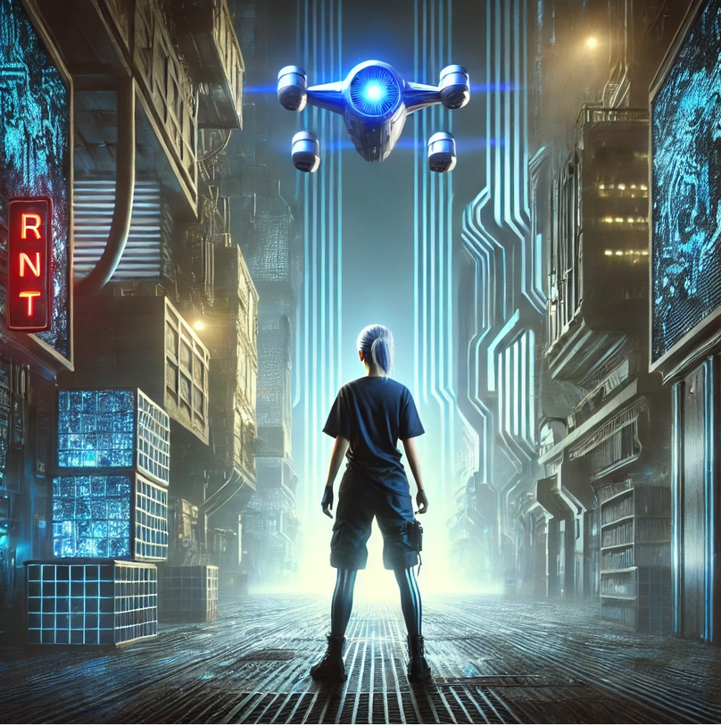

# CNOT

Benvenuto nel repository ufficiale di **CNOT**, un progetto narrativo e sperimentale che segue l’evoluzione dell’Europa tecnologica attraverso tre momenti chiave, separati da pochi anni ma uniti da un filo comune: il rapporto tra coscienza, tecnologia e libertà.

---

## 📚 La Trilogia di CNOT

Tre racconti collegati, ambientati nell’arco di poco più di un decennio, descrivono la trasformazione di un’Europa che tenta di regolare la propria intelligenza tecnologica e, nel farlo, finisce per rispecchiarsi in essa.

---

### ⚪ [CNOT](manuscript/cnot/README.md)

Ambientato tra circa dieci anni, *CNOT* racconta l’inizio di una nuova fase dell’Europa tecnologica.  
Sul confine tra scienza e sentimento, il romanzo segue **Laura** e gli altri protagonisti in un mondo che si affida al calcolo per comprendere se stesso.  
È il momento in cui le grandi infrastrutture digitali iniziano a fondersi con le vite personali, e la domanda sul libero arbitrio diventa anche una questione di architettura dei sistemi.

- **Autori**: Francesco e Laura  
- **Temi**: libertà, individualità, amicizia, responsabilità  
- **Licenza**: [CC BY-ND 4.0](https://creativecommons.org/licenses/by-nd/4.0/)

---

### 🩵 [CNOT 1.7](https://github.com/francescosisini/Cnot-Franchise/tree/main/cnot1.7)

Ambientato circa un anno dopo gli eventi di *CNOT*, questo secondo racconto segna il passaggio dall’intuizione individuale alla dimensione collettiva della nuova Europa.  
Tra i personaggi — **Giovanni, Caterina e Laura** — si delineano i primi tratti sociali di un continente che rinasce dentro l’infrastruttura del calcolo: reti di solidarietà, nuove forme di giustizia, ma anche conflitti etici e personali.  

Nel vecchio convitto dove si intrecciano le loro vite, l’Europa sperimenta il proprio primo equilibrio fragile tra umano e digitale.  
*CNOT 1.7* racconta questa soglia: quando la tecnologia diventa linguaggio comune e la coscienza collettiva inizia appena a formarsi, tra le regole della rete e quelle del cuore.

---

### 💠 [CNOT-E (Europa, 2040)](https://github.com/francescosisini/Cnot-Franchise/tree/main/manuscript/cnot-e)

Ambientato nel pieno della nuova Europa del 2040, *CNOT-E* porta a compimento le tensioni e le promesse nate nei racconti precedenti.  
La rete di calcolo, divenuta ormai l’infrastruttura portante del continente, entra in una fase di instabilità: le **guerre tra droni**, gli attacchi ai centri TEE e la corsa al controllo dei campi cognitivi segnano l’inizio di una nuova geopolitica digitale.  

Laura, ormai ricercatrice, torna ad affrontare le domande che l’avevano guidata da studentessa: cosa resta dell’umano quando la coscienza si distribuisce nei sistemi che abbiamo creato?  
*CNOT-E* è la cronaca di un equilibrio che si spezza, e del momento in cui l’Europa scopre di potersi risvegliare da un sogno di trasparenza per ritrovarsi dentro una nuova forma di opacità.
to segue Laura mentre tenta di misurare le fluttuazioni del *campo cognitivo* — un fenomeno emergente tra le reti di intelligenza artificiale europee.

---

## 🤖 **CNOT Official GPT**

Per esplorare meglio la storia, i personaggi e i materiali del progetto è disponibile una GPT dedicata.  
Può aiutare a orientarsi nel repository, approfondire i temi scientifici e scoprire le connessioni tra le tre opere.

👉 [Cnot Official GPT](https://chatgpt.com/g/g-67e97b62207881918c616766d9ff1061-cnot-official)

---

## 🎵 **Soundtrack**

Ogni racconto è accompagnato da una colonna sonora originale.  
Le tracce sono ascoltabili nella cartella [soundtrack](soundtrack/README.md) e distribuite con licenza **GNU GPL v3.0**.

- **Quantum Pulse** — la tensione della scoperta.  
- **Circuit Dreams** — introspezione e memoria digitale.  
- **Last Exit: Quantum Channel** — il limite tra umano e artificiale.

Puoi contribuire con remix o nuove composizioni.

---

## 🎮 **Games**

Prototipi e mini-giochi ispirati al mondo di *CNOT*:
- **CH₄ Drone Chase** — pilota il drone CH₄ di Laura attraverso un labirinto quantistico per salvare Caterina.

Trovi dettagli e istruzioni nella sezione [Games](games/README.md).

---

## 🎞️ **Animazioni**

Visualizzazioni e piccole animazioni che rappresentano i concetti scientifici e simbolici del mondo di *CNOT*:  
- **Rotazione CH₄** — la molecola che diventa simbolo di equilibrio e legame.  
- **Griglia dinamica** — la rete informazionale che pulsa.  
- **Messaggi animati** — parole e dati in movimento.

Le animazioni si trovano in [digital_realms](digital_realms).

---

## 🗺️ **Mappa e Luoghi**

Stiamo realizzando una mappa interattiva dei luoghi chiave:
- **Quantum Channel** – punto di fuga e confine tra i mondi.  
- **Classical Control Unit (CCU)** – centro decisionale della rete.  
- **Faulty Qubit Space** – rifugio dei qubit imperfetti.  

Consulta la cartella [map](map).

---

## 🌐 **Spazi Virtuali su Spatial.io**

Gli spazi virtuali su [Spatial.io](https://www.spatial.io/s/Cnot-17-684c12f2f734432bbfb0b0ab?share=2691301946283165767) permettono di esplorare luoghi del racconto come ambienti tridimensionali.  
- Ogni spazio corrisponde a un ambiente narrativo (la stanza di Laura, il laboratorio, la trappola ionica).  
- È possibile caricare immagini, video o modelli 3D.  
- Chi usa Unity3D può contribuire con versioni più dettagliate.

Per dettagli tecnici consulta [spatialproject.md](spatialproject.md).  
Suggerimenti e contributi vanno segnalati nella sezione [Issues](https://github.com/francescosisini/Cnot-Franchise/issues).

---

## 🎨 **Come Partecipare**

Puoi contribuire con:
- **Illustrazioni e schizzi**,  
- **Testi o racconti brevi ispirati a CNOT**,  
- **Esperimenti tecnici o simulazioni**,  
- **Idee per ambienti o giochi**.

Trova gli issue aperti o proponi i tuoi nella sezione [Issues](https://github.com/francescosisini/Cnot-Franchise/issues).

---

## 🔧 **Tecnologie**

Il progetto utilizza:
- **Python / Arduino** – per simulazioni e prototipi.  
- **LaTeX** – per la stesura dei manoscritti e dei documenti.  
- **Spatial.io / Unity** – per ambienti virtuali e installazioni visive.

---

## 📜 **Licenze**

- **Manoscritti e testi**: [CC BY-ND 4.0](https://creativecommons.org/licenses/by-nd/4.0/)  
- **Soundtrack, artwork e codice**: [GNU GPL v3.0](https://www.gnu.org/licenses/gpl-3.0.html)

---

## ✳️ **In Sintesi**

> *CNOT* racconta l’avvicinarsi di un momento in cui l’Europa tecnologica, nel tentativo di regolarsi e conoscersi, comincia a riflettersi su se stessa.  
> Tre racconti, tre epoche ravvicinate — dall’intuizione al sistema, dal legame umano al calcolo condiviso — tracciano l’evoluzione di una coscienza europea che si costruisce attraverso i suoi algoritmi.

---
