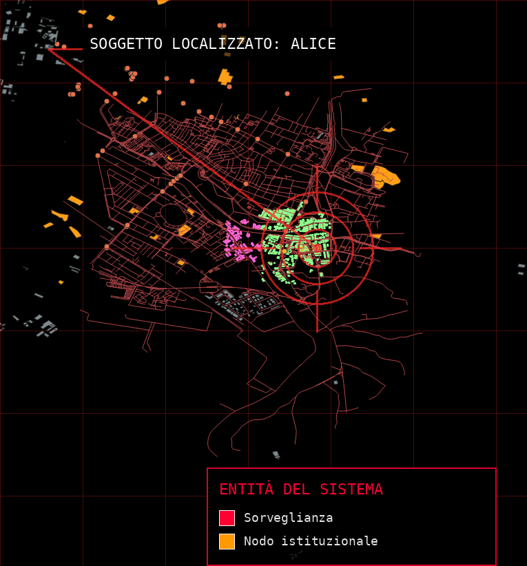

# Cnot Franchise



**Cnot è un GIS narrativo:** una mappa di luoghi, infrastrutture, personaggi ed eventi da cui nascono storie, romanzi, ambienti esplorabili e documenti di mondo.
Leggi il [manifesto](Manifesto.md) 

Il progetto  parte dalla costruzione di un territorio possibile. Ogni luogo può contenere dati, memorie, conflitti, traiettorie, documenti, personaggi collegati e accessi immersivi.

I libri raccontano alcuni percorsi dentro questa mappa.
Il GIS conserva e organizza il mondo.
Il WebXR permette di visitarne alcuni spazi.

> Non costruiamo una mappa per illustrare una storia.
> Costruiamo una mappa perché le storie possano accadere.

---
## Le opere principali

Il franchise nasce da tre nuclei narrativi: **Cnot**, **Cnot 1.7** e **Cnot-e**.

### [Cnot](books/cnot/)

**Cnot** è il nucleo originario del progetto: una fuga dentro e fuori da un computer quantistico. Introduce i personaggi principali e i temi fondanti del franchise: codice, intelligenza artificiale, quantistica, amicizia, decriptazione e attraversamento di ambienti tecnologici.

```text
Cnot = fuga dal computer quantistico
```

### [Cnot 1.7](books/cnot1.7/)

**Cnot 1.7** sposta il baricentro verso l’esplorazione dei luoghi. È un’esperienza narrativa di tipo **urbex**: il mondo viene attraversato come una serie di spazi abbandonati, marginali o semi-nascosti, dove tracce materiali, mappe, stanze, oggetti e architetture diventano indizi narrativi.

```text
Cnot 1.7 = esplorazione urbex del mondo e dei suoi luoghi
```

### [Cnot-e](books/cnot-e/)

**Cnot-e** è un’avventura irrisolvibile nella complicata Europa del 2050: un mondo di infrastrutture fragili, crisi politiche, sistemi digitali, confini mobili, dipendenze energetiche e tensioni difficili da decifrare. Qui il franchise assume pienamente la forma di un GIS narrativo del futuro.

```text
Cnot-e = avventura irrisolvibile nell’Europa del 2050
```

Insieme, queste opere costruiscono il passaggio dal libro al mondo: dalla fuga, all’esplorazione, fino alla mappa complessa degli eventi futuri.
---

## Idea generale

Cnot è pensato come un franchise narrativo e tecnico insieme.

Il cuore del progetto è un atlante del futuro: un sistema di luoghi reali, immaginari o ibridi, organizzati come elementi di una grande mappa narrativa.

Dentro questa mappa possono essere collocati:

* luoghi;
* edifici;
* città;
* infrastrutture;
* datacenter;
* centrali energetiche;
* scuole;
* convitti;
* case;
* zone abbandonate;
* eventi;
* crisi;
* personaggi;
* organizzazioni;
* documenti;
* linee temporali;
* ambienti esplorabili.

La storia nasce dall’incrocio di questi livelli.

```text
luoghi
  ↓
infrastrutture
  ↓
personaggi
  ↓
eventi
  ↓
conflitti
  ↓
storie
```

---

## Struttura del repository

```text
Cnot-Franchise/
├── books/
├── characters/
├── docs/
├── maps/
├── media/
├── research/
├── tools/
├── worlds/
├── xr/
└── archive/
```

---

## Sezioni principali

### [books/](books/)

La cartella `books/` contiene le opere narrative del progetto.

```text
books/
├── cnot/
├── cnot1.7/
├── cnot-e/
└── NCR/
```

Qui si trovano i testi, le versioni LaTeX, HTML, PDF, EPUB, immagini e materiali editoriali legati ai libri.

I libri non sono considerati oggetti isolati: sono percorsi narrativi dentro il mondo mappato di Cnot.

---

### [worlds/](worlds/)

La cartella `worlds/` contiene il database narrativo del mondo.

```text
worlds/
└── cnot/
    ├── datasets/
    ├── docs/
    ├── entities/
    ├── factions/
    ├── gis/
    ├── infrastructure/
    ├── overlays/
    ├── renders/
    ├── schema/
    ├── systems/
    └── timelines/
```

Questa sezione raccoglie la struttura profonda del franchise:

* entità;
* luoghi;
* organizzazioni;
* infrastrutture;
* sistemi;
* dataset;
* timeline;
* eventi;
* overlay narrativi;
* materiali cartografici.

È il livello in cui il mondo viene documentato come se fosse un ambiente reale.

---

### [maps/](maps/)

La cartella `maps/` contiene il livello GIS e cartografico.

```text
maps/
├── data/
├── qgis/
└── web/
```

Questa sezione contiene:

* progetti QGIS;
* dati GeoPackage;
* dati GeoJSON;
* esportazioni qgis2web;
* mappe web;
* dati geografici narrativi.

Il GIS serve a collocare luoghi ed eventi nello spazio.

La logica è:

```text
luogo sulla mappa
  ↓
scheda informativa
  ↓
evento narrativo
  ↓
personaggi collegati
  ↓
eventuale ambiente WebXR
```

---

### [xr/](xr/)

La cartella `xr/` contiene gli ambienti WebXR e i modelli 3D esplorabili nel browser.

```text
xr/
├── viewers/
├── voxel/
├── scripts/
└── textures/
```

Il caso principale è il convitto virtuale:

```text
xr/viewers/convitto/
```

Il viewer carica il modello:

```text
xr/viewers/convitto/models/convitto.glb
```

Sono presenti anche varianti del modello, tra cui:

```text
convitto.glb          modello principale con texture
convitto_simple.glb   modello semplificato senza texture
```

Il WebXR permette di trasformare alcuni luoghi del GIS in spazi visitabili.

---

### [characters/](characters/)

La cartella `characters/` contiene personaggi, profili, dati comportamentali e materiali di character design.

```text
characters/
├── neo-pi-r/
└── profiles/
```

I personaggi non sono trattati soltanto come figure narrative, ma anche come layer del GIS.

Ogni personaggio può essere collegato a:

* luoghi;
* traiettorie;
* eventi;
* relazioni;
* profili psicologici;
* decisioni;
* punti di crisi;
* documenti;
* archi narrativi.

La sezione `neo-pi-r/` raccoglie esperimenti e dati legati alla modellazione dei personaggi tramite profili di personalità.

---

### [research/](research/)

La cartella `research/` contiene materiali di studio e riferimento.

```text
research/
├── papers/
├── news/
└── neurocriticum/
```

Questa sezione sostiene lo sfondo culturale, scientifico e filosofico del franchise.

Può includere materiali su:

* intelligenza artificiale;
* coscienza;
* sistemi complessi;
* infrastrutture;
* energia;
* clima;
* neuroscienze;
* quantistica;
* tecnologie critiche;
* crisi sociali e politiche.

La ricerca non è separata dalla narrativa: fornisce materia concettuale per costruire il mondo e generare eventi.

---

### [media/](media/)

La cartella `media/` contiene materiali visivi, audio e promozionali.

```text
media/
├── artwork/
├── soundtrack/
├── video/
└── banners/
```

Qui possono essere raccolti:

* immagini;
* illustrazioni;
* copertine;
* video;
* colonne sonore;
* materiali social;
* banner;
* visual di supporto.

Questa sezione alimenta la dimensione visiva e comunicativa del franchise.

---

### [tools/](tools/)

La cartella `tools/` contiene script e strumenti riutilizzabili.

```text
tools/
├── gis/
├── image/
└── utilities/
```

Gli strumenti servono a costruire, convertire, generare o preparare materiali del progetto.

Esempi:

* script GIS;
* script per immagini;
* generatori di legende;
* convertitori;
* utility di produzione;
* strumenti per pipeline editoriali o XR.

Gli script dovrebbero essere il più possibile generici e riutilizzabili.

---

### [docs/](docs/)

La cartella `docs/` contiene documentazione generale del progetto.

Può ospitare:

* descrizione dell’architettura del franchise;
* note sul funzionamento GIS + WebXR;
* istruzioni di pubblicazione;
* guide operative;
* documentazione per collaboratori;
* manifesto del progetto.

---

### [archive/](archive/)

La cartella `archive/` contiene materiale non più attivo, legacy o sperimentale.

```text
archive/
├── drafts/
├── old_code/
├── old_exports/
└── old_games/
```

Qui finiscono:

* vecchi export;
* prototipi abbandonati;
* giochi non più attivi;
* codice legacy;
* bozze superate;
* materiali conservati per memoria o recupero futuro.

L’archivio non rappresenta la superficie attiva del franchise, ma conserva tracce utili della sua evoluzione.

---

## GIS + narrazione

Il GIS non è un’aggiunta decorativa.

È uno degli strumenti centrali con cui il mondo viene pensato.

Ogni elemento della mappa può diventare un nodo narrativo:

```text
coordinate
  ↓
luogo
  ↓
funzione
  ↓
evento
  ↓
personaggi
  ↓
documenti
  ↓
storia
```

Un luogo può essere reale, immaginario o ibrido.

Un evento può essere pubblico, segreto, documentato, distorto o ancora da scoprire.

Una storia può nascere dal rapporto fra un luogo, un’infrastruttura, una crisi e un personaggio.

---

## GIS + WebXR

Il progetto usa il GIS come mappa generale e il WebXR come ingresso immersivo in luoghi specifici.

```text
GIS feature
  ↓
popup / metadata
  ↓
xr_url
  ↓
WebXR viewer
  ↓
GLB model
```

In questo modo un punto della mappa può aprire uno spazio esplorabile.

Il GIS organizza il mondo.
Il WebXR permette di entrarci.

---

## Metodo narrativo

Il metodo di costruzione del franchise può essere riassunto così:

```text
1. mappare luoghi e infrastrutture
2. definire personaggi e traiettorie
3. collocare eventi nello spazio e nel tempo
4. collegare documenti, dati e immagini
5. far emergere conflitti e anomalie
6. scrivere storie a partire dalla mappa
7. trasformare alcuni luoghi in ambienti visitabili
```

La narrazione nasce dall’intersezione dei layer.

```text
layer geografico
+ layer infrastrutturale
+ layer tecnologico
+ layer politico
+ layer climatico
+ layer psicologico
+ layer degli eventi
= possibilità narrativa
```

---

## Pubblicazione

Le parti pubblicabili del progetto possono essere ospitate come pagine statiche.

In particolare:

```text
maps/web/
xr/viewers/
docs/
```

possono diventare la base di un atlante pubblico del franchise.

Una possibile porta d’ingresso è:

```text
Cnot Virtual Atlas
  ↓
mappa interattiva
  ↓
luoghi ed eventi
  ↓
ambienti WebXR
  ↓
libri e materiali di ricerca
```

---

## Filosofia del repository

Questo repository non è solo un contenitore tecnico.

È parte integrante del progetto.

Cnot tratta un mondo narrativo come qualcosa che può essere:

* scritto;
* mappato;
* modellato;
* versionato;
* documentato;
* attraversato;
* esplorato;
* esteso.

Il repository è quindi un archivio vivo: conserva il mondo, ne mostra la costruzione e permette di generare nuove storie a partire dalla sua geografia.

