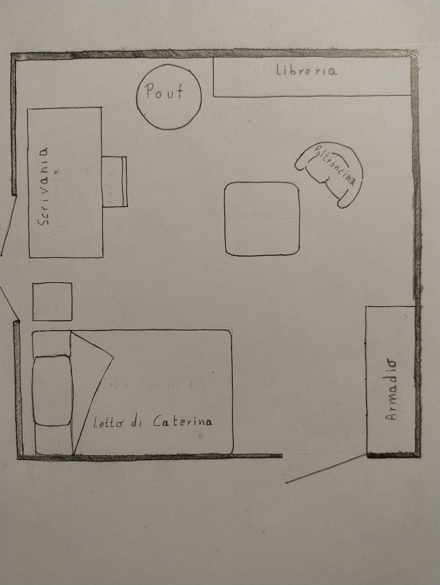

# Capitolo 1 

> "Cara Caterina,  
> ti scrivo con le mani sporche di terra e il cuore in fiamme.  
> Ogni giorno mi sveglio con l'ansia che il cielo sia un po' più basso,  
> che il vento porti con sé un alto grido soffocato di una specie che non c'è più.  
> Eppure continuo a lottare, perché se ci sei tu,  
> tu che hai il coraggio che io non ho,  
> tu che hai il coraggio che io non ho... "

> «Vuoi che continui, Cate? Non mi sembra giunga nulla di nuovo alla discussione...»

Laura, seduta sulla poltroncina degli ospiti, sta aiutando l'amica a sbrigare un po' della corrispondenza,  
visto che lei è impegnata in faccende che la coinvolgono molto di più.

> «Ma sì dai, mi sembra così angosciata, poverina...»

Caterina è a pochi decimetri da Laura, davanti all'armadio.  
Vediamo la situazione: 

Laura riprende, ma il 70% di ciò che legge le sfugge,  
perché la sua attenzione è catturata dai movimenti mimetici di Alice,  
seduta sul letto di fronte a lei.




 Un viaggio difficile da organizzare tra bilglietti introvabili, alberghi al completo,  impegni precedenti e consegne da rispettare sul lavoro. Mancano 36 ore al volo che la condurrà negli US ed  è quasi tutto a posto ma Caterina non  sa che sua sorella le sta cucinando  una bella vendetta da gustare calda anzichè fredda. 

Lei se ne va a New York e la lascia a casa con suo padre e sua madre, proprio ora che potrebbero passare una settimana insieme. Certo, Alice comprende che il lavoro è importante. Infatti, se fosse solo per quello, non le brucerebbe così tanto.

Ma il problema non è il lavoro. In realtà, lei ci va per Mark. Figurati, se non ci fosse lui, avrebbe sicuramente preferito passare l’estate con lei. In fondo, di corsi di aggiornamento ce ne sono tanti, nel mondo. No, lei lo sa che è per Mark.

Così, tranquilla, con il suo PC in mano, a gambe incrociate sul letto, mostra uno sguardo innocente. Laura si avvicina alla sorella dell’amica per sbirciare, ma Alice, con una piccola rotazione, si sottrae al suo sguardo.

> «Scusami, sai!»

Poi incolla il testo nella sezione *Lyrics* di Suno:
```
🎤 Lyrics:...
She leaves and I stay
like a folder left open
half full, half erased
I blink, and she's already gone
```
> «*Qui capirai quanto ci sono rimasta male...*»
e aggiunge il prompt di esecuzione:

🎛 Style Description (max 200 characters):
Bilingual emotional synth-pop with ambient textures, cinematic flow, and AI female vocals. Slow build. Glitchy, dreamlike, bittersweet. Like diary pages sung in code.


> «Lascia da perdere, è arrabbiata con me.»

> «Non sono arrabbiata, solo che voglio finire una cosa.»

> «Ha ragione, sono io che sono troppo curiosa. Però si è fatta un po’ tardi, è ora che vado a prendere Valentina.»

> «No, aspetta solo un attimo, ti prego.»

Alice preme *Create* e la sua canzone viene generata.

> «Ora la scarico, colleghiamo le casse e voilà!»

Le note di pianoforte sintetico arpeggiano velocemente una nenia in Sol maggiore. Poi, con un respiro sussurrato, inizia il primo verso.

```
*(Verse)*  
She leaves and I stay  
like a folder left open  
half full, half erased  
I blink, and she's already gone  

*(Verse)*  
She goes to New York  
I stay with a lamp shaped like a heart  
plastic love, three settings  
warm, cold, ambient—mine is blinking  
```

Al ritornello:
> «*E qui voglio vederti piangere!*»
```
**I'm not angry, I'm just here**
```

una lacrima solca il viso di Caterina, che a stento simula tranquillità continuando ad ordinare le cose da mettere in valigia.

> «Certo che le semplifichi proprio la partenza, tu.»

Caterina appoggia il phone e si avvicina alla sorella per abbracciarla.

> «Non ci provare!» le urla.

Caterina non reagisce, è abituata. Alice si libera le ginocchia dal PC e lo poggia sul letto.

> «Io esco, mangio qualcosa con le ragazze.»

Caterina si asciuga gli occhi.

> «Va bene, ma a casa per le dieci. È l’ultima sera che passiamo insieme.»

> «Devo andare anch’io, Kate.»

> «Va bene Laura, grazie di essere venuta.»

> «Ciao Kate. Ciao Alice.»

Prima di chiudere la porta, Laura ha un attimo di esitazione. C’era ancora una cosa, anzi, il motivo principale per cui aveva raggiunto Caterina.

> «Ma non sai ancora nulla del visto!»

> «Non preoccuparti, Laura. Vedrai che non ci saranno problemi. In ogni caso, se ci fossero difficoltà ti chiamo.»

Saluta l’amica con un bacio e corre a prendere Vale.  
Per fortuna manca ancora qualche anno alla sua adolescenza.
