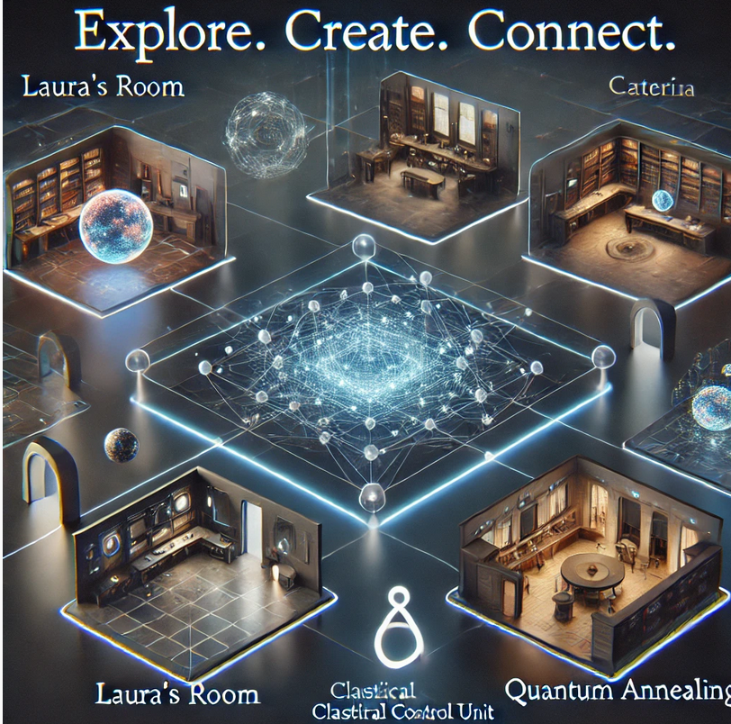

## Esplorare il Mondo di *Cnot* su Spatial.io

Su [Spatial.io](https://www.spatial.io/s/Cnot-Presentazione-6777f2362fa1edbc86c3b351?share=254166736093461738) è stato creato un progetto per rappresentare il mondo di *Cnot* in una dimensione virtuale. Ogni luogo della storia è riprodotto come spazio virtuale e collegato agli altri tramite portali, offrendo un'esperienza immersiva e interattiva.

### Caratteristiche del progetto

- **Spazi dedicati ai luoghi della storia:** Ogni ambiente narrativo, come la stanza di Laura, la sala di Caterina, la *Classical Control Unit* o il *Quantum Annealing*, è rappresentato come spazio virtuale. Attualmente, gli spazi sono vuoti, ma i collegamenti tra di essi sono già funzionanti e possono essere verificati.
- **Editing abilitato:** Gli spazi sono configurati per consentire modifiche da parte degli utenti. È possibile caricare immagini, video, oggetti 3D o altri contenuti utili a rendere gli spazi più ricchi e interessanti.
- **Segnalazione di errori:** È possibile segnalare eventuali errori nei collegamenti tra portali o l'assenza di collegamenti aprendo un'issue sul repository GitHub.
- **Contributi per arricchire gli ambienti:** Chi possiede competenze in Spatial.io o Unity3D può collaborare per realizzare ambienti più complessi, come la stanza di Laura o la sala di Caterina.

### Modalità di partecipazione

1. **Modificare e arricchire gli spazi:**
   - Gli spazi sono accessibili e modificabili. È possibile aggiungere immagini, video, oggetti 3D o qualsiasi contenuto creativo che arricchisca l’esperienza.
2. **Verificare e segnalare errori:** 
   - Eventuali errori nei collegamenti o portali mancanti possono essere segnalati aprendo un'issue su GitHub.
3. **Realizzare ambienti complessi:**
   - Chi ha esperienza con Spatial.io o Unity3D può proporre nuove idee e partecipare alla realizzazione di ambienti dettagliati, segnalando la propria disponibilità tramite le issue sul repository.
4. **Collaborare a idee creative:** 
   - Ogni proposta per rendere gli spazi più interessanti e immersivi è la benvenuta.

### Finalità del progetto

L’obiettivo è creare un’esperienza virtuale collaborativa, permettendo agli appassionati di *Cnot* di esplorare i luoghi della storia, interagire con altri utenti e contribuire attivamente allo sviluppo del progetto. Ogni contributo è considerato prezioso per rendere il mondo virtuale del libro sempre più coinvolgente.

**Chiunque desideri partecipare è invitato a unirsi al progetto e contribuire alla realizzazione del mondo di *Cnot*!**
