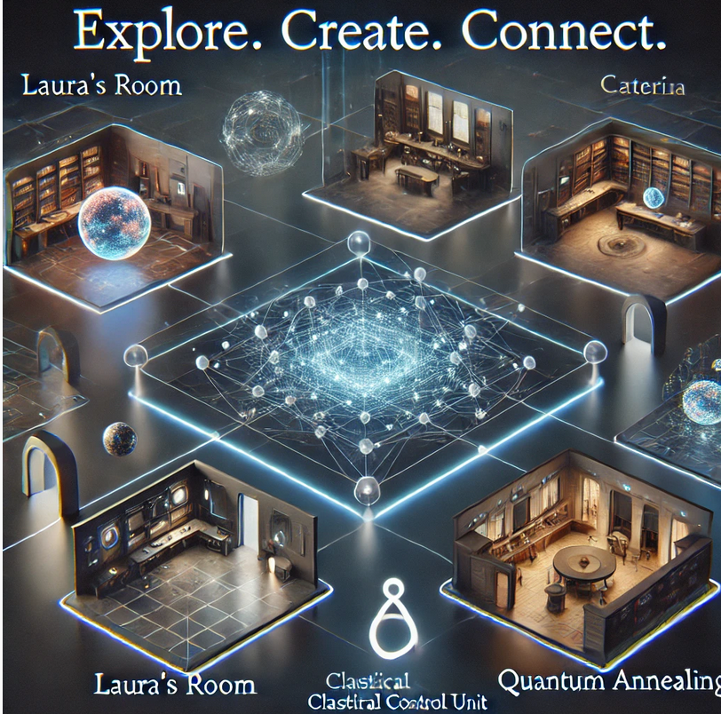

## Esplorare il Mondo di *Cnot* in WebXR

Il mondo di *Cnot* può essere esplorato attraverso una modalità **XR basata su WebXR**, cioè una tecnologia che permette di aprire ambienti 3D direttamente nel browser. L’obiettivo non è dipendere da una singola piattaforma esterna, ma costruire una serie di spazi virtuali pubblicabili come pagine web, collegabili alla mappa GIS del progetto e visitabili da computer, smartphone o, dove supportato, visori VR.



In questa nuova impostazione, ogni luogo della storia viene rappresentato come ambiente 3D autonomo, esportato in formato `.glb` e caricato da un viewer WebXR. La mappa GIS funziona come porta d’accesso: cliccando su un luogo, il visitatore può aprire la corrispondente scena XR.

La struttura generale è:

```text
mappa GIS
   ↓
punto / edificio / area narrativa
   ↓
link al viewer WebXR
   ↓
modello 3D in formato GLB
   ↓
esplorazione dello spazio virtuale nel browser
```

### Caratteristiche del progetto

- **Spazi virtuali dedicati ai luoghi della storia:** ogni ambiente narrativo, come la stanza di Laura, la sala di Caterina, la *Classical Control Unit*, il *Quantum Annealing* o il convitto, può essere ricostruito come spazio voxel o modello 3D visitabile.
- **Tecnologia aperta e portabile:** gli ambienti non sono vincolati a un singolo servizio proprietario. Il modello viene salvato come `.glb` e visualizzato tramite una pagina WebXR basata su HTML, JavaScript e A-Frame/Three.js.
- **Collegamento GIS + XR:** ogni ambiente può essere associato a un punto, edificio o area nella mappa GIS. Nel popup della mappa viene inserito un link che apre il viewer WebXR corrispondente.
- **Modelli voxel convertibili con script Python:** i modelli realizzati in Goxel possono essere esportati come file `.vox` testuali e convertiti in `.glb` tramite script Python, senza passare da Unity o Blender.
- **Repository come archivio del mondo virtuale:** i file sorgenti, gli script di conversione, i viewer e i modelli esportati possono essere conservati nel repository GitHub, rendendo il progetto più stabile e ricostruibile nel tempo.
- **Segnalazione di errori e contributi:** eventuali problemi nei link GIS, nei modelli 3D, nei viewer o nella navigazione possono essere segnalati aprendo un’issue sul repository.

### Modalità di partecipazione

1. **Creare o modificare ambienti voxel**
   - Gli ambienti possono essere modellati in Goxel o in altri strumenti voxel compatibili.
   - Il formato consigliato per la pipeline attuale è il `.vox` testuale di Goxel, con righe del tipo:

     ```text
     v x y z r g b
     ```

   - Ogni riga rappresenta un voxel con posizione e colore.

2. **Convertire i modelli in GLB**
   - I file voxel vengono convertiti in `.glb` tramite lo script Python:

     ```bash
     python3 goxel_vox_to_glb.py input.vox convitto.glb --voxel-size 0.5 --center --floor-y0
     ```

   - Il file generato viene copiato nella cartella del viewer:

     ```text
     convitto-webxr-viewer/models/convitto.glb
     ```

3. **Verificare il viewer WebXR in locale**
   - Per provare l’ambiente prima della pubblicazione:

     ```bash
     cd convitto-webxr-viewer
     python3 -m http.server 8000
     ```

   - Poi aprire nel browser:

     ```text
     http://localhost:8000
     ```

4. **Collegare l’ambiente alla mappa GIS**
   - Nel GeoJSON o nella tabella attributi di QGIS si può aggiungere un campo, per esempio:

     ```text
     xr_url
     ```

   - Il campo contiene il link pubblico al viewer WebXR:

     ```text
     https://nomeutente.github.io/virtual_space/convitto-webxr-viewer/
     ```

   - Nel popup della mappa il link può essere mostrato così:

     ```html
     <a href="{xr_url}" target="_blank">Entra nello spazio XR</a>
     ```

5. **Segnalare errori o proporre miglioramenti**
   - Errori nei collegamenti, problemi di scala, modelli ruotati, ambienti non caricati o link mancanti possono essere segnalati tramite issue GitHub.
   - Sono benvenute anche proposte per nuovi ambienti, oggetti voxel, hotspot informativi, audio narrativi o collegamenti tra luoghi.

### Aggiungere una nuova sezione XR

Per aggiungere un nuovo ambiente virtuale, ad esempio una stanza, un edificio o una zona narrativa, si può seguire questa procedura:

```text
1. creare il modello voxel in Goxel
2. esportare il file .vox testuale
3. convertire .vox → .glb con lo script Python
4. duplicare o configurare un viewer WebXR
5. copiare il modello nella cartella models/
6. testare il viewer in locale
7. pubblicare su GitHub Pages
8. aggiungere il link XR nella mappa GIS
```

Esempio:

```bash
python3 goxel_vox_to_glb.py stanza_archivio.vox stanza_archivio.glb --voxel-size 0.5 --center --floor-y0
cp stanza_archivio.glb stanza-archivio-webxr-viewer/models/convitto.glb
cd stanza-archivio-webxr-viewer
python3 -m http.server 8000
```

Il viewer può mantenere sempre lo stesso nome interno del modello:

```text
models/convitto.glb
```

oppure può essere modificato nel file `index.html`, cambiando il percorso del modello caricato.

### Pubblicazione

La pubblicazione può avvenire tramite GitHub Pages. Una struttura possibile è:

```text
virtual_space/
├── map/
├── convitto-webxr-viewer/
├── stanza-archivio-webxr-viewer/
├── voxel_pipeline/
└── README.md
```

Dopo aver aggiornato i file:

```bash
git add .
git commit -m "Add WebXR virtual spaces"
git push
```

Su GitHub Pages si può pubblicare il repository dalla sezione:

```text
Settings → Pages → Deploy from branch → main → /root
```

Gli ambienti saranno poi raggiungibili con link simili a:

```text
https://nomeutente.github.io/virtual_space/map/
https://nomeutente.github.io/virtual_space/convitto-webxr-viewer/
https://nomeutente.github.io/virtual_space/stanza-archivio-webxr-viewer/
```

Questi URL possono essere usati direttamente nei popup della mappa GIS.

### Finalità del progetto

L’obiettivo è costruire un **atlante narrativo GIS + XR** del mondo di *Cnot*: una mappa che non si limita a indicare luoghi, ma permette di entrare in ambienti virtuali, visitarli e collegarli alla storia.

Il GIS dà al progetto una struttura geografica e documentaria. WebXR aggiunge una dimensione immersiva, visitabile e pubblicabile sul web. Insieme permettono di costruire un sistema aperto, estendibile e più resistente alla chiusura di piattaforme esterne.

In forma compatta:

```text
luogo sulla mappa
   ↓
scheda informativa
   ↓
link XR
   ↓
ambiente 3D visitabile
   ↓
espansione narrativa del mondo di Cnot
```

Chiunque desideri partecipare può contribuire creando modelli voxel, migliorando i viewer, segnalando errori, proponendo nuovi luoghi o arricchendo gli ambienti con contenuti narrativi e visivi.
